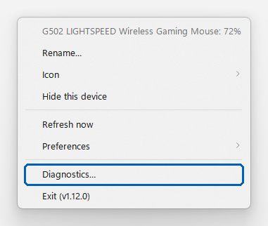

# Contributing to Halo Battery

Thank you for helping. This page tells you how to:

1. [Report a device that is not detected or shows a wrong level](#1-report-a-device)
2. [Record a USB capture when the protocol is not known](#2-record-a-usb-capture)
3. [Open a pull request](#3-open-a-pull-request)

## 1. Report a device

Before you report, do these steps:

1. Close the maker's software (Synapse, G HUB, the web driver and similar). It can hold the receiver.
2. Wake the device: move the mouse, press a key, or turn the headset on.
3. Right-click a Halo Battery icon and select **Diagnostics…**. The "No devices found" icon has this item too. If you run the app from source, `probe.bat` shows the same information in a console window; copy all of it into the issue.

   <picture>
     <source media="(prefers-color-scheme: dark)" srcset="docs/contributing/diagnostics-menu-dark.png">
     
   </picture>

4. The report opens in your text editor (usually Notepad). It is a text file, `diagnostics.txt`, in `%APPDATA%\HaloBattery`. It starts like this:

   ```
   === Poll result ===
   G502 LIGHTSPEED Wireless Gaming Mouse: 71%   [logitech:xxxxxxxx]

   === Protocol details ===
   [Logitech] pid=c539 'USB Receiver'
     idx=1 'G502 LIGHTSPEED Wireless Gaming Mouse' unit=xxxxxxxx feature 1001: 0f 57 00 00 -> 71%

   === All HID devices ===
   VID=046d PID=c539 if=2 usage=ff00:0001 'Logitech' 'USB Receiver'
   ```

   The **All HID devices** part is the most important for a device that is not supported: it shows the ids (`VID`, `PID`) and the collections (`usage`) of your device.

Then [open an issue](../../issues/new?template=device.yml) and:

- Write the device name, and how it is connected (receiver, cable or Bluetooth).
- Drag `diagnostics.txt` into the comment box (type `%APPDATA%\HaloBattery` in the address bar of File Explorer to find it). Do not paste only a part of it.
- If the maker's app shows a battery level, write that level and the level that Halo Battery shows.

The report contains Bluetooth MAC addresses and device serial numbers. You can replace them with `xx` before you post.

## 2. Record a USB capture

Halo Battery reads a battery only with a known protocol. The protocol comes from the maker's documentation, from an open-source project (for example OpenRazer, Solaar, HeadsetControl, rivalcfg or SDL), or from a capture of the maker's own app. Halo Battery does not send guessed commands to a device, because a wrong command can change the device's settings.

If you know an open-source project that reads your device's battery, put the link in your issue. That is the fastest way.

If there is no such project, and the maker's app (or web driver) shows the battery, a capture of that app gives the exact request and reply. USBPcap's [illustrated guide](https://desowin.org/usbpcap/tour.html#use-usbpcap-as-wireshark-extcap) has screenshots of each Wireshark window in these steps, and the [Wireshark USB page](https://wiki.wireshark.org/CaptureSetup/USB) has more detail.

1. Install [Wireshark](https://www.wireshark.org/download.html). In the installer, select **USBPcap**. Restart the computer.
2. **Close the maker's app completely** (also from the tray).
3. Start Wireshark and start a capture on the **USBPcap** interface that has your receiver or cable. If you are not sure which one, try each until moving the mouse makes packets appear.
4. **Start the maker's app** and wait until it shows the battery level. If it has a battery or device page, open it.
5. Wait approximately 10 seconds, then stop the capture.
6. Select **File → Save As** and save as `.pcapng`. Upload the file (for example with WeTransfer or Google Drive) and put the link in your issue.

If the capture has no packets from the maker's app, change one setting in the app (for example the DPI) during the capture and then change it back. That shows whether the capture sees the app at all.

Bluetooth devices: Halo Battery shows the level that Windows itself reports. If **Settings → Bluetooth & devices** shows no battery for your device, Halo Battery cannot show one either.

## 3. Open a pull request

1. Fork the repository and make a branch from the latest `main`.
2. Put a new device in the provider for its protocol family (`providers/*.py`). Make a new provider only for a new protocol. A new provider must be:
   - imported in `providers/__init__.py`;
   - added to the provider list in `halo_battery.pyw` (the app and `--probe` use it).
3. Only send commands that come from a source you can name. Put the source (project, file and line, or your capture) in a comment at the top of the provider.
4. Add unit tests in `tests/`. They use fake HID devices, so no hardware is necessary. Run all tests from the repository root:

   ```
   python -m unittest discover -s tests
   ```

5. Add a line to `CHANGELOG.md` under `[Unreleased]`, a row to the table in `docs/devices.md`, and a section in `docs/protocols.md` that tells how the device is read and names the source.
6. In the pull request description, write:
   - which issue it closes;
   - the source of the protocol;
   - if you tested it on real hardware, and with which device;
   - which other open pull requests change the same files.

Look at the open issues and pull requests first, so that two people do not do the same work.
