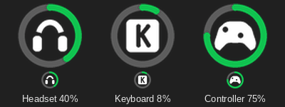

# Halo Battery

Battery levels for wireless mice, keyboards, headsets and controllers in the Windows system tray - one icon per device, no vendor software.

While charging, the arc slowly "breathes":

Each device gets its own tray icon: a battery ring with the device's pictogram in the middle. The arc fills clockwise from the top, turns amber as the level approaches your alert threshold and red at or below it, and breathes green while the device charges. Hover over an icon for the exact percentage; right-click it to rename, hide, change the preferences or take a diagnostics report.

Levels are read over USB/HID (a dongle, a receiver or a cable), from Xbox-style controller reports, and from Windows itself for Bluetooth devices.

## Installation

### Option 1: the ready-made .exe (recommended)

1. Download `HaloBattery-<version>.zip` from the [Releases](../../releases/latest) page.
2. Extract it somewhere permanent, e.g. `C:\Tools`, so you get `C:\Tools\HaloBattery\HaloBattery.exe`, and run `HaloBattery.exe`. Keep the `HaloBattery` folder together: the .exe needs the `_internal` folder next to it.
3. Right-click the tray icon → **Start with Windows**.

The app checks for a new release once a day and adds **Download vX.Y.Z…** to the menu when there is one. To update: tray menu → **Exit**, then replace the folder; **Start with Windows** follows the new copy. If you used the old single-file `HaloBattery.exe`, delete it.

Windows SmartScreen may warn about an unrecognized app on first launch, because the file is not code-signed: **More info → Run anyway**. Some antivirus tools flag unsigned Python apps by mistake (usually a generic `!ml` detection). The release is built by GitHub Actions straight from this repository, with public build logs; if you would rather not trust it, use Option 2.

### Option 2: from source

1. Install [Python 3.10+](https://www.python.org/downloads/) with **Add python.exe to PATH** checked.
2. Download or clone this repository somewhere permanent, e.g. `C:\Tools\HaloBattery`.
3. Run `install_and_run.bat`, then right-click the tray icon → **Start with Windows**.

### Portable mode

To keep the settings, the log and the battery history next to the app instead of in `%APPDATA%\HaloBattery` (for a USB stick or a folder you sync), create an empty file named `portable.txt` in the app's folder, next to `HaloBattery.exe` (or `halo_battery.pyw` when running from source), and restart the app. The folder must be writable: if it is not (e.g. inside `C:\Program Files`), the app keeps using `%APPDATA%\HaloBattery`. Settings are not moved over by themselves: copy `config.json` from `%APPDATA%\HaloBattery` to keep them. **Start with Windows** still adds an entry to the registry of the current user.

`build_exe.bat` builds it yourself into `dist\HaloBattery`. Releases are built automatically: pushing a tag like `v1.8.0` makes GitHub Actions build the app and attach the zip (`.github/workflows/release.yml`).

## Features

### The icon

- **Centre**: a headset, a mouse, a keyboard (a keycap with a K), an Xbox or PlayStation controller, or the Bluetooth rune - the pictogram can be turned off in the menu.
- **Colour**: follows the taskbar (white on a dark bar, black on a light one). With [MyDockFinder](https://store.steampowered.com/app/1787090/MyDockFinder/) running it follows its top menu bar instead. With a transparent taskbar (e.g. TranslucentTB) pick **Icon colour → White** or **Black**.
- **Amber**: close to the alert threshold. **Red**: at or below it.
- **Green and breathing**: charging - the animation can be turned off in the menu, leaving a plain green arc.
- **Translucent**: the mouse is asleep and keeps its last level for 5 minutes. A device that is switched off leaves the tray and comes back when it is switched on.

The low battery notification fires once, and again only after the device has been charged.

### Tray menu

Right-click a device icon to open its menu. It looks like a Windows 11 menu (acrylic background, rounded corners, the light or dark app theme) and is sharp at any display scale. If it does not work on your PC, set `"fluent_menu": false` in `%APPDATA%\HaloBattery\config.json` to get the classic Windows menu back.

- **Rename…**: give the device your own name (for example, two controllers with the same name). **Reset name** goes back to the device's own name.
- **Icon**: pick the pictogram of this device (Automatic, Mouse, Keyboard, Headset, Controller or Bluetooth), for example a controller over Bluetooth that shows the Bluetooth pictogram.
- **Low battery alert at**: an alert level for this device only (off, 10–30%), or **Default** to follow Preferences. The red ring follows it too.
- **Hide this device**: remove its icon, for example for a controller that always reports 100%.
- **Refresh now**
- **Preferences**:
  - **Poll interval** (15 s to 5 min) and **Low battery alert** (off, 10–30%): change them with the − and + buttons or the mouse wheel, the menu stays open
  - **Alert when fully charged** (a notification once per charge, on by default)
  - **Estimated time left**: "about 5 h of use left" in the tooltip, from how fast the device has drained since its last charge. Only time the device is awake and on battery counts, and there is no estimate until it has been used for 30 minutes and dropped 3%. The history is kept in `%APPDATA%\HaloBattery\history.json`.
  - **Quiet while gaming** (on by default): while a game or other app is full screen (the same signal Windows uses to hold its own notifications), alerts are held and shown once it closes - one per device, and a low battery alert is dropped if the device was put on the charger meanwhile. Devices are polled only every 5 minutes then, since every poll talks to them; plugging something in still updates at once.
  - **Sound with the low battery alert** (off by default): also play the Windows "Battery Low" sound ("Battery Critical" at 5% or less), for full-screen games where the notification is not seen. It plays again every 5 minutes while the device stays low and off the charger, and **Quiet while gaming** does not hold it back
  - **Windows Bluetooth devices**, **Device pictogram**, **Percentage in the icon** (the level as a number in the ring instead of the pictogram, amber or red when low), **Charging animation**
  - **PlayStation full mode (Bluetooth)** (off by default): always read the battery of a PS4 / PS5 controller over Bluetooth. Some games stop seeing the controller in that mode until it is turned off and on
  - **Status file for other apps** (off by default): writes `%APPDATA%\HaloBattery\status.json` after every poll, for Rainmeter, a Stream Deck plugin or a script. Each device has `name`, `level`, `charging`, `online`, `kind`, `seconds_left` and the tooltip `text`; `running` turns false when the app exits, and `updated_unix` says how fresh it is. Turning it off deletes the file.
  - **Device types**: turn off a brand or device family; its devices are then not opened at all
  - **Icon colour**: Automatic (the Windows theme, or MyDockFinder's menu bar while it is running), White or Black
  - **Start with Windows** (per-user registry key, no admin rights needed)
  - **Check for updates**: once a day, on by default; a notification and a **Download vX.Y.Z…** item appear when a new release is out
- **Hidden devices** (only when a device is hidden): click a device to show it again
- **Diagnostics…**: writes a detailed report and opens it

## Supported devices

Mice, keyboards, headsets and controllers from Razer, Logitech, SteelSeries, HyperX, Corsair, ASUS ROG, Sony, Xbox, Nintendo, 8BitDo, GameSir, Audeze, JBL, Keychron, MCHOSE, WLmouse, G-Wolves, LAMZU, Lofree, Pulsar / ATK VXE, Angry Miao, Hitscan and more, over a 2.4 GHz receiver, a USB cable or Bluetooth.

**[See the full list of supported devices](docs/devices.md)**. It shows the connection and whether each device has been tested on real hardware.

## Add your device

Is your device not detected, or does it show a wrong level? Send a diagnostics report. It takes approximately one minute:

1. Close the maker's software (Synapse, G HUB, the web driver and similar) and wake the device up (move the mouse, press a key).
2. Right-click a Halo Battery icon and select **Diagnostics…**. The "No devices found" icon has this item too.

   <picture>
     <source media="(prefers-color-scheme: dark)" srcset="docs/contributing/diagnostics-menu-dark.png">
     
   </picture>

3. The report `diagnostics.txt` opens in Notepad. [Open an issue](../../issues/new?template=device.yml), write the device name and how it is connected (receiver, cable or Bluetooth), and drag the file into the comment box. The file is in `%APPDATA%\HaloBattery`.

The report contains Bluetooth MAC addresses and device serial numbers. You can replace them with `xx` before you post.

[CONTRIBUTING.md](CONTRIBUTING.md) has the details: what the report shows, how to record a USB capture of the maker's app when the protocol is not known, and how to open a pull request.

## Troubleshooting

1. Close Synapse, the WLmouse web driver and other battery tools - they may hold the receiver.
2. Wake the mouse up by moving it.
3. Run `probe.bat` or choose **Diagnostics…** from the tray menu, and send the report as [Add your device](#add-your-device) tells you.
4. **"python312.dll was not found"**, or **Start with Windows** says the app runs from a temporary folder: the app was started straight from the ZIP, or only `HaloBattery.exe` was copied out of it. Extract the whole ZIP to a folder of its own (the `_internal` folder must stay next to the .exe) and run `HaloBattery.exe` from there.

Settings, the log and the diagnostics report live in `%APPDATA%\HaloBattery` (in the app's own folder in [portable mode](#portable-mode)). The first line of the diagnostics report shows which folder is used.

## Credits

- WLmouse protocol: @len0c ([incconutwo/mouse-battery-tray](https://github.com/incconutwo/mouse-battery-tray), MIT).
- MCHOSE protocol: the write-up by @alexfrih ([alexfrih/mchose-linux](https://github.com/alexfrih/mchose-linux), recovered from MCHOSE's own web driver); the G7 from @kek353's monitor and the dump in [#8](https://github.com/HeyOkay/HaloBattery/issues/8).
- Hitscan Hyperlight protocol: @sopparus ([sopparus/hitscan-battery](https://github.com/sopparus/hitscan-battery)), who mapped it from the vendor application's USB traffic and confirmed it in the [libratbag discussion](https://github.com/libratbag/libratbag/issues/1893).
- AM Infinity 8K protocol: the AJAZZ Control Center project ([Aiacos/ajazz-control-center](https://github.com/Aiacos/ajazz-control-center), GPL-3.0), which reads the same USB id on its own AJ159 APEX unit.
- BlackShark V2 Pro 2023: the OpenRazer driver ([PR #2862](https://github.com/openrazer/openrazer/pull/2862)). Razer PIDs and transaction ids: OpenRazer and [RazerBatteryTaskbar](https://github.com/Tekk-Know/RazerBatteryTaskbar).
- Arctis Nova Pro Omni status layout: [loteran/Arctis-Sound-Manager](https://github.com/loteran/Arctis-Sound-Manager).
- Finalmouse UltralightX protocol: Finalmouse's XPanel web configurator.
- The reference implementations behind individual devices - HeadsetControl, rivalcfg, Solaar, G-Helper, HyperHeadset, mouse.xyz, [`@openmouse/protocol`](https://github.com/OpenMouse-Project/openmouse), keychron-battery-dkms, JBL_Baterry_Monitor and others - are credited next to the device they were used for in [docs/protocols.md](docs/protocols.md).

## License

MIT, see [LICENSE](LICENSE).
